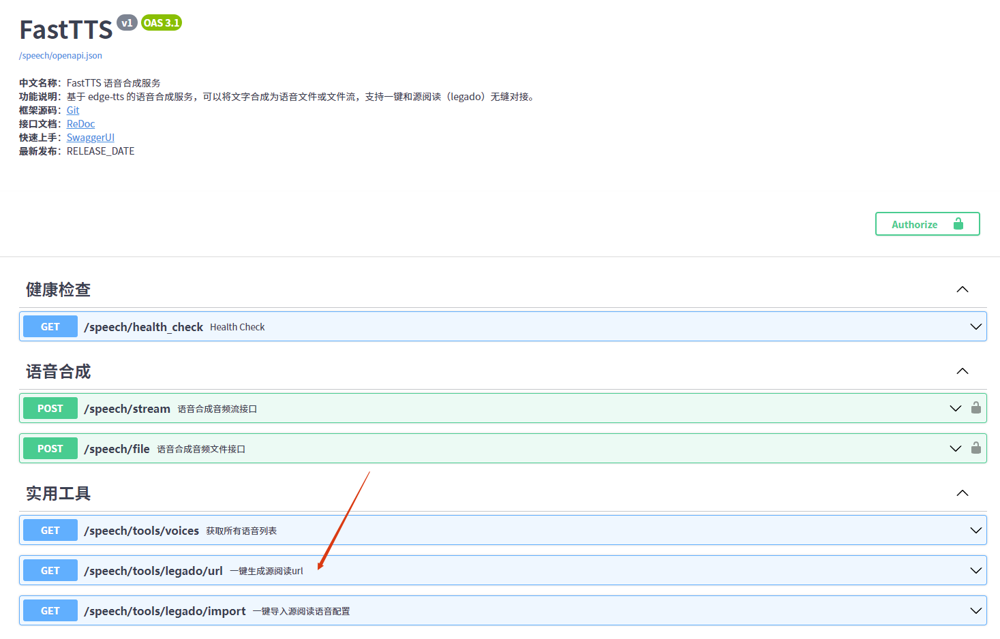
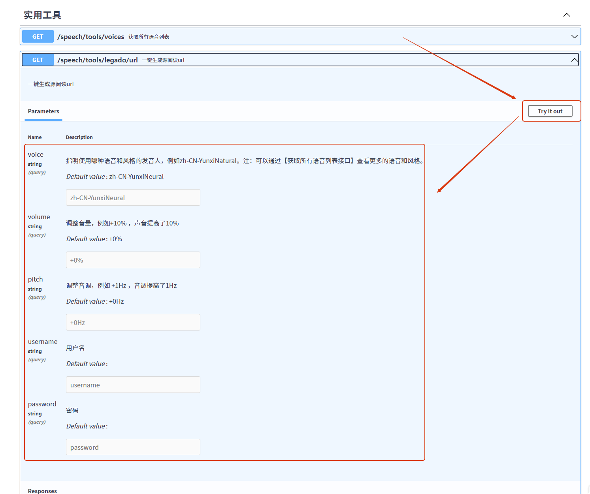
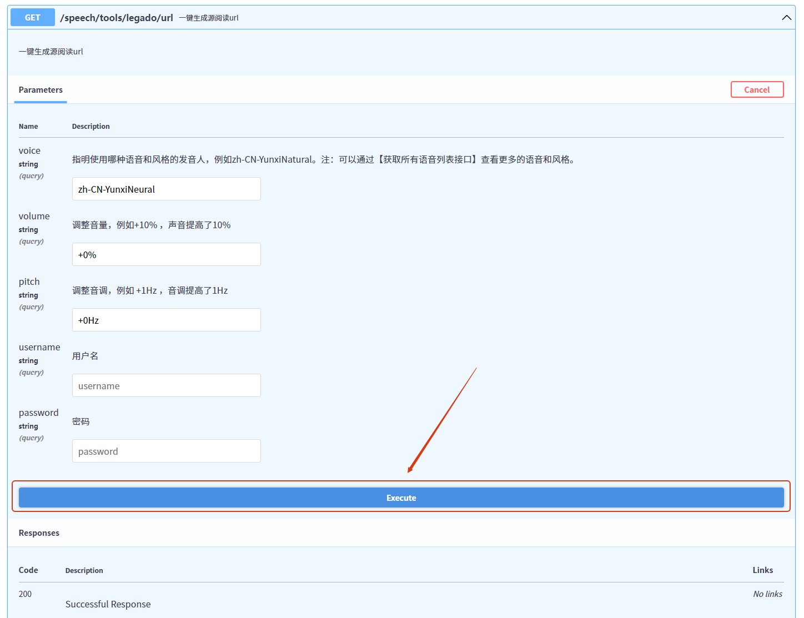
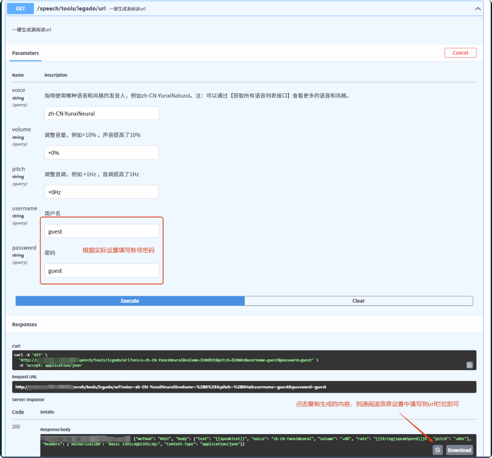
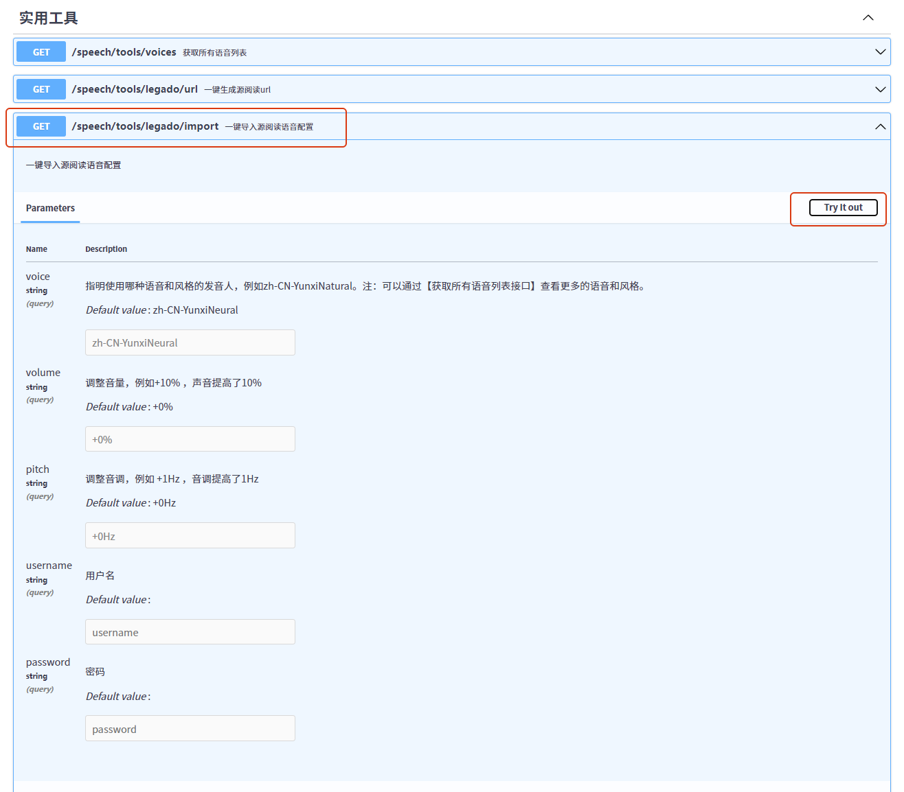
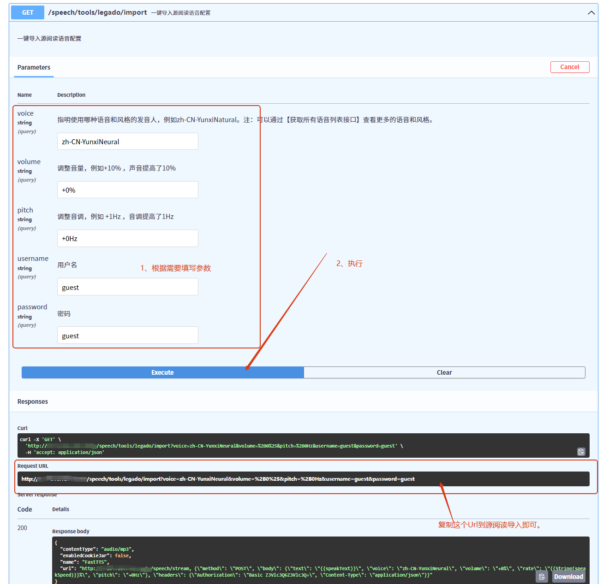

## FastTTS: 简单语音合成服务
  [](https://deepwiki.com/jagerzhang/FastTTS)

## 项目介绍
本项目基于 Edge-TTS 和 FastFlyer 开发框架，可以直接私有化部署提供语音合成服务，支持和源阅读 APP 无缝对接。

- 体验地址：
  - [在线合成](https://tts-demo.zhang.ge/speech/tools/online)
  - [在线调试](https://tts-demo.zhang.ge/speech/docs)
- 账号密码：guest / guest

`注：小水管，仅供测试，不保证可用性。` 

## 框架介绍
FastFlyer 是基于 FastAPI 设计的轻量级 API 开发框架。在 FastAPI 优异特性的基础上集成了一系列开箱即用的组件，包括Redis、MySQL、Kafka等。采用 SDK 接入方式，内置脚手架代码生成等辅助工具，让研发人员只需要专注于业务逻辑的实现，真正开箱即用！

注：更多框架介绍请阅读：[FastFlyer](https://github.com/jagerzhang/fastflyer)


## 快速部署

```
docker run --name fasttts -d -p 8080:8080 jagerzhang/fast-tts 
```
成功启动后，访问：`http://<host>:8080/speech/docs` 可以看到 `Swagger` 工具页面。

## 简单鉴权

如果需要外网访问，建议开启接口鉴权：

```
docker run -d \
    --name fasttts \
    -p 8080:8080 \
    -e flyer_auth_enable=1 \    # 【可选】启用 BasicAuth 鉴权
    -e flyer_auth_user=guest \  # 【可选】BasicAuth 账号 
    -e flyer_auth_pass=guest \  # 【可选】BasicAuth 密码
    jagerzhang/fast-tts 
```

开启鉴权后，生成源阅读的配置也会自动带上鉴权头部，可以无缝对接。

## 对接源阅读

服务已集成和源阅读APP的配置生成、一键导入工具，请在服务的`Swagger`页面参考以下指引使用。

### 一键生成源阅读 Url

参考如图步骤，得到 `JSON` 配置，填写到源阅读新增语音的`URL`栏位即可：









### 源阅读一键导入

同样的，参考如图步骤，得到一键导入的 `Url`，然后到源阅读使用网络导入即可：





## 二次开发

初次上手，请仔细阅读FastFlyer说明文档：[正式开发](https://github.com/jagerzhang/fastflyer#正式开发)

## 环境变量
项目支持通过环境变量来修改各种配置，详细参数说明请阅读FastFlyer说明文档：[环境变量](https://github.com/jagerzhang/fastflyer#环境变量)

## 如何加入
PR is welcome!
